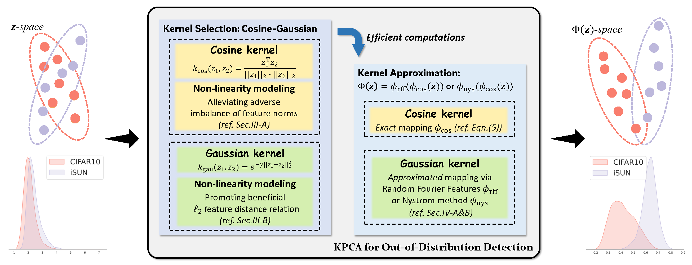

# Kernel PCA for Out-of-Distribution Detection: Non-Linear Kernel Selections and Approximations
This is the official PyTorch implementation of the paper: *Kernel PCA for Out-of-Distribution Detection: Non-Linear Kernel Selections and Approximations* ([arxiv](https://arxiv.org/abs/2505.15284)).

This is an **extension study** of our previous work accepted by NeurIPS'24: *Kernel PCA for Out-of-Distribution Detection* ([conference](https://proceedings.neurips.cc/paper_files/paper/2024/hash/f2543511e5f4d4764857f9ad833a977d-Abstract-Conference.html), [arxiv](https://arxiv.org/abs/2402.02949), [code](https://github.com/fanghenshaometeor/ood-kernel-pca)).

If our work benefits your researches, welcome to cite!
```
@inproceedings{fang2024kpcaood,
author = {Fang, Kun and Tao, Qinghua and Lv, Kexin and He, Mingzhen and Huang, Xiaolin and YANG, JIE},
booktitle = {Advances in Neural Information Processing Systems},
editor = {A. Globerson and L. Mackey and D. Belgrave and A. Fan and U. Paquet and J. Tomczak and C. Zhang},
pages = {134317--134344},
publisher = {Curran Associates, Inc.},
title = {Kernel PCA for Out-of-Distribution Detection},
url = {https://proceedings.neurips.cc/paper_files/paper/2024/file/f2543511e5f4d4764857f9ad833a977d-Paper-Conference.pdf},
volume = {37},
year = {2024}
}
```

```
@misc{fang2025kpcaood,
title = {Kernel PCA for Out-of-Distribution Detection: Non-Linear Kernel Selections and Approximations}, 
author = {Kun Fang and Qinghua Tao and Mingzhen He and Kexin Lv and Runze Yang and Haibo Hu and Xiaolin Huang and Jie Yang and Longbin Cao},
year = {2025},
eprint = {2505.15284},
archivePrefix = {arXiv},
primaryClass = {cs.LG},
url = {https://arxiv.org/abs/2505.15284}, 
}
```

## KPCA for OoD detection in a nutshell

The InD-OoD disparities are exploited through a fresh perspective of *non-linear feature subspace* in this work.
We leverage the framework of KPCA to attain the discriminative non-linear subspace and deploy the reconstruction error on such subspace to distinguish InD and OoD data.
Two challenges emerge: 
- *(i)* the learning of an effective non-linear subspace, i.e., the selection of kernel function in KPCA,
- *(ii)* the computation of the kernel matrix with large-scale InD data.

Regarding the two challenges,
- For the former, we reveal two vital non-linear patterns that closely relate to the InD-OoD disparity, leading to the establishment of a Cosine-Gaussian kernel for constructing the subspace.
- For the latter, we introduce two techniques to approximate the Cosine-Gaussian kernel with significantly cheap computations. 
In particular, our approximation is further tailored by incorporating the InD data confidence, which is demonstrated to promote the learning of discriminative subspaces for OoD data.

Our study presents new insights into the non-linear feature subspace for OoD detection and contributes practical explorations on the associated kernel design and efficient computations, yielding a KPCA detection method with distinctively improved efficacy and efficiency.

<a href="pics/fig_kpca_framework.png"><div align="center"></div></a>

### Main differences of this extension study from its [conference version]((https://proceedings.neurips.cc/paper_files/paper/2024/hash/f2543511e5f4d4764857f9ad833a977d-Abstract-Conference.html)) [1]:
- We supplement more analyses and experiments to support the non-linear kernel selection for OoD detection in Section III.
- A data-dependent Nystr&ouml;m method is employed to build an explicit approximated mapping in Section IV-B, where the sampling strategy in Nystr&ouml;m is intentionally devised based on InD data confidence.
Such a modified data-dependent approximation leads to more discriminative InD and OoD representations and outperforms the data-independent way in [1] with enhanced OoD detection performance and a cheaper computational complexity.
- We supplement a numerical analysis in Section IV-D on the approximation performance of our method in terms of KPCA reconstruction errors on InD and OoD data within this deep learning regime for a comprehensive investigation.
- More experiments are provided in Section V, including comparisons with a broader variety of strong baselines and in-depth analyses on our KPCA detection method to validate its effectiveness.

## Pre-requisite
Prepare in-distribution and out-distribution data sets following the instructions in the [KNN repo](https://github.com/deeplearning-wisc/knn-ood).
Then, modify the data paths in `utils_ood.py` as yours.

For ResNet50 on ImageNet under *supervised contrastive learning*, download our trained checkpoint [here](https://drive.google.com/drive/folders/1-ISbfuEqMZnLpnSud6v2GSl2SNjSiXTJ?usp=sharing) and put it as
```
ood-kpca-extension
├── model
├── save
|   └── ImageNet
|       └── R50
|           └── supcon
|               └── supcon-linear.pth
├── ...
```

*The supervised contrast learning R50 checkpoint released in the [KNN repo](https://github.com/deeplearning-wisc/knn-ood) only contains backbone weights and misses the last linear layer. We further fine-tune the linear layer on top of the backbone weights following the suggestions in the [supcontrast repo](https://github.com/HobbitLong/SupContrast). Our trained checkpoint is released [here](https://drive.google.com/drive/folders/1-ISbfuEqMZnLpnSud6v2GSl2SNjSiXTJ?usp=sharing).*

## Running
step.1. Run the `feat_extract_largescale.sh` to extract the penultimate layer features.
```
bash feat_extract_largescale.sh
```

step.2. Run the `energy_training.sh` to compute the Energy values of the training samples for Nystr&ouml;m sampling.
```
bash energy_training.sh
```

step.3. Run the `main.sh` to perform KPCA OoD detection via RFFs and Nystr&ouml;m.
```
bash main.sh
```

## 

If u have problems about the code or paper, u could contact me (kun.fang@polyu.edu.hk) or raise issues here.

If the code benefits ur researches, welcome to fork and star ⭐ this repo! :)

---
[1] K. Fang, Q. Tao, K. Lv, M. He, X. Huang, and J. Yang. Kernel PCA
for Out-of-Distribution Detection. NeurIPS 2024.